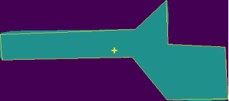
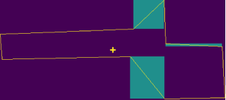
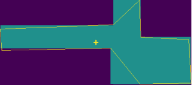
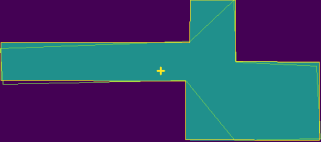
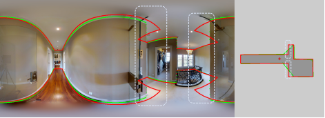
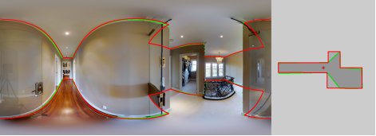

# Post-Processing 

## Update
- 2023.5.18 We found that it was unreasonable to use cross product to detect occlusion in manhattan post-processing [layout.py#L70](https://github.com/zhigangjiang/LGT-Net/blob/b642d6288e3a4bf265e54ab93eed3455e760402b/postprocessing/dula/layout.py#L70). We fixed this problem [here](https://github.com/zhigangjiang/LGT-Net/blob/aae66ab9a2f361bc4e16af564f244acff5ec8aee/postprocessing/dula/layout.py#LL80C4-L80C15). In addition, we add some optimizations to force the layout coordinates to align to satisfy the constraints based on the Manhattan assumption.

## Step

1. Simplify polygon by [DP algorithm](https://en.wikipedia.org/wiki/Ramer%E2%80%93Douglas%E2%80%93Peucker_algorithm)

   
2. Detect occlusion, calculating box fill with 1 

3. Fill in reasonable sampling section

   
4. Output processed polygon

## performance
It works, and a performance comparison on the MatterportLayout dataset:

| Method | 2D IoU(%)  | 3D IoU(%) | RMSE | $\mathbf{\delta_{1}}$ |
|--|--|--|--|--|
without post-proc    | 83.52 | 81.11 | 0.204 | 0.951 |
original post-proc |83.12 | 80.71 | 0.230 | 0.936|\
optimized  post-proc | 83.48 | 81.08| 0.214 | 0.940 |

original:

optimized:

