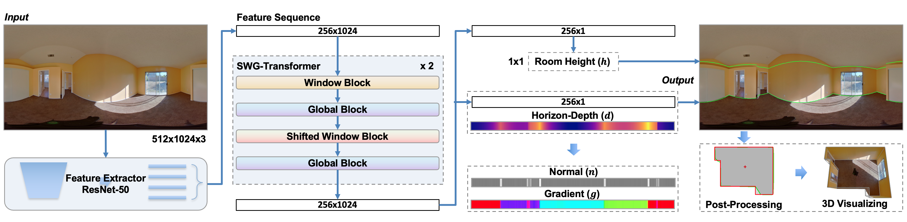
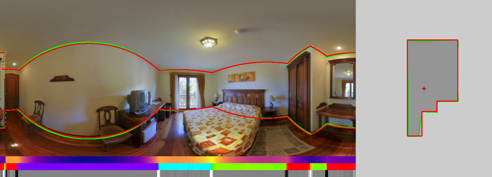

# LGT-Net
This is PyTorch implementation of our paper "[LGT-Net: Indoor Panoramic Room Layout Estimation with Geometry-Aware Transformer Network](https://arxiv.org/abs/2203.01824)"(CVPR'22). [[Supplemental Materials](https://drive.google.com/file/d/1vmNoWXdxKc4or2iUKNvkKRTV8pwxSi0J/view?usp=sharing)] [[Video](https://youtu.be/jh0pkaJaOr8)] [[Presentation](https://docs.google.com/presentation/d/1XC3SNCjuXT7m2jjT64UhUA145yBgHJaY/edit?usp=sharing&ouid=116719086346747292409&rtpof=true&sd=true)] [[Poster](https://drive.google.com/file/d/1Uy0qdkDVSARnz4ef9oNgI9tG_UgiuO00/view?usp=sharing)] 





# Update
- 2023.5.18 Update post-processing. If you want to reproduce the post-processing results of paper, please switch to the old [commit](https://github.com/zhigangjiang/LGT-Net/tree/b642d6288e3a4bf265e54ab93eed3455e760402b). Check out the [Post-Porcessing.md](Post-Porcessing.md) for more information.


# Demo
- [demo app](https://huggingface.co/spaces/zhigangjiang/LGT-Net) that runs on HuggingFace Space🤗.
- [demo script](https://colab.research.google.com/drive/1mvwXVXGlrkApdMW6_8_prFBHjxwTReA6?usp=sharing) that runs on Google colab.


# Installation
Install our dependencies:
```shell
pip install -r requirements.txt
```

# Preparing Dataset
### MatterportLayout
Office MatterportLayout dataset is at [here](https://github.com/ericsujw/Matterport3DLayoutAnnotation).
>If you have problems using this dataset, attention to this [issue](https://github.com/zhigangjiang/LGT-Net/issues/6).

Make sure the dataset files are stored as follows:
```
src/dataset/mp3d
|-- image
|   |-- 17DRP5sb8fy_08115b08da534f1aafff2fa81fc73512.png
|-- label
|   |-- 17DRP5sb8fy_08115b08da534f1aafff2fa81fc73512.json
|-- split
    |-- test.txt
    |-- train.txt
    |-- val.txt

```

---

**Statistics**

|  Split| All |4 Corners |6 Corners |8 Corners |>=10 Corners |
|--|--|--|--|--|--|
| All | 2295  | 1210 | 502 | 309 | 274|
|Train   |1647  | 841 | 371 | 225 | 210 |
|Val   |190   | 108 | 46 | 21 | 15 |
|Test    |458   | 261 | 85 | 63 | 49 |

---

### ZInd
Office ZInd dataset is at [here](https://github.com/zillow/zind).

Make sure the dataset files are stored as follows:
```
src/dataset/zind
|-- 0000
|   |-- panos
|   |   |-- floor_01_partial_room_01_pano_14.jpg
|   |-- zind_data.json
|-- room_shape_simplicity_labels.json
|-- zind_partition.json
```

**Statistics**

|  Split| All |4 Corners |5 Corners |6 Corners |7 Corners |8 Corners|9 Corners |>=10 Corners |Manhattan |No-Manhattan(%) |
|--|--|--|--|--|--|--|--|--|--|--|
|All| 31132 | 17293 |1803 | 7307 | 774 | 2291 | 238 | 1426 |26664 | 4468(14.35%)|
|Train   | 24882 | 13866 |1507 | 5745 | 641 | 1791 | 196 | 1136 |21228 | 3654(14.69%)|
|Val    |  3080 | 1702 | 153  |  745 | 81  |  239 | 22  | 138  |2647 | 433(14.06%)|
|Test    |  3170 | 1725 | 143  |  817 | 52  |  261 | 20  | 152  |2789  | 381(12.02%)|

---

### PanoContext and Stanford 2D-3D
We follow the same preprocessed pano/s2d3d  proposed by [HorizonNet](https://github.com/sunset1995/HorizonNet#dataset).
You also can directly download the dataset file in [here](https://drive.google.com/file/d/164DnSxz6ap8GcytRAPfJlIMvNPaikZEc/view?usp=sharing).

Make sure the dataset files are stored as follows:
```
src/dataset/pano_s2d3d
|-- test
|   |-- img
|   |   |-- camera_0000896878bd47b2a624ad180aac062e_conferenceRoom_3_frame_equirectangular_domain_.png
|   |-- label_cor
|       |-- camera_0000896878bd47b2a624ad180aac062e_conferenceRoom_3_frame_equirectangular_domain_.txt
|-- train
|   |-- img
|   |-- label_cor
|-- valid
    |-- img
    |-- label_cor
     
```
# Downloading Pre-trained Weights
We provide pre-trained weights on individual datasets at [here](https://drive.google.com/drive/folders/1bOZyXeuNnwFEC9nw7EgJUwMiI685obdT?usp=sharing).

- [mp3d/best.pkl](https://drive.google.com/file/d/1o97oAmd-yEP5bQrM0eAWFPLq27FjUDbh/view?usp=sharing): Training on MatterportLayout dataset
- [zind/best.pkl](https://drive.google.com/file/d/1PzBj-dfDfH_vevgSkRe5kczW0GVl_43I/view?usp=sharing): Training on ZInd dataset
- [pano/best.pkl](https://drive.google.com/file/d/1JoeqcPbm_XBPOi6O9GjjWi3_rtyPZS8m/view?usp=sharing): Training on PanoContext(train)+Stanford2D-3D(whole) dataset
- [s2d3d/best.pkl](https://drive.google.com/file/d/1PfJzcxzUsbwwMal7yTkBClIFgn8IdEzI/view?usp=sharing): Training on Stanford2D-3D(train)+PanoContext(whole) dataset
- [ablation_study_full/best.pkl](https://drive.google.com/file/d/1U16TxUkvZlRwJNaJnq9nAUap-BhCVIha/view?usp=sharing): Ablation Study: Ours (full) on MatterportLayout dataset

Make sure the pre-trained weight files are stored as follows:
```
checkpoints
|-- SWG_Transformer_LGT_Net
|   |-- ablation_study_full
|   |   |-- best.pkl
|   |-- mp3d
|   |   |-- best.pkl
|   |-- pano
|   |   |-- best.pkl
|   |-- s2d3d
|   |   |-- best.pkl
|   |-- zind
|       |-- best.pkl
```
# Evaluation
You can evaluate by executing the following command:

- MatterportLayout dataset
    ```shell
    python main.py --cfg src/config/mp3d.yaml --mode test --need_rmse
    ```
- ZInd dataset
    ```shell
    python main.py --cfg src/config/zind.yaml --mode test --need_rmse
    ```
- PanoContext dataset
  ```shell
  python main.py --cfg src/config/pano.yaml --mode test --need_cpe --post_processing manhattan --force_cube
- Stanford 2D-3D dataset
    ```shell
    python main.py --cfg src/config/s2d3d.yaml --mode test --need_cpe --post_processing manhattan --force_cube
    ```
    - `--post_processing` type of post-processing approach, 
      we use [DuLa-Net](https://github.com/SunDaDenny/DuLa-Net) post-processing and optimize by adding occlusion detection (described in [here](Post-Porcessing.md) ) to process `manhattan` constraint (`manhattan_old` represents the original method),
      use [DP algorithm](https://en.wikipedia.org/wiki/Ramer%E2%80%93Douglas%E2%80%93Peucker_algorithm)  to process `atalanta` constraint, default is disabled.
    - `--need_rmse` need to evaluate root mean squared error and delta error, default is disabled.
    - `--need_cpe` need to evaluate corner error and pixel error, default is disabled.
    - `--need_f1` need to evaluate corner metrics (Precision, Recall and F$_1$-score) 
      with **10 pixels** as threshold(code from [here](https://github.com/bertjiazheng/indoor-layout-evaluation)), default is disabled.
    - `--force_cube` force cube shape when evaluating, default is disabled.
    - `--wall_num` different corner number to evaluate, default is all.
    - `--save_eval` save the visualization evaluating results of each panorama, 
      the output results locate in the corresponding checkpoint directory 
      (e.g., `checkpoints/SWG_Transformer_LGT_Net/mp3d/results/test`), default is disabled.

# Training
Execute the following commands to train  (e.g., MatterportLayout dataset):
```shell
python main.py --cfg src/config/mp3d.yaml --mode train
```
You can copy and modify the configuration in `YAML` file for other training.

# Inference
We provide an inference script (`inference.py`) that you can
try to predict your panoramas by executing the following command (e.g., using pre-trained weights of MatterportLayout dataset):
```shell
python inference.py --cfg src/config/mp3d.yaml --img_glob src/demo/demo1.png --output_dir src/output --post_processing manhattan
```
It will output json files(`xxx_pred.json`, format is the same as [PanoAnnotator](https://github.com/SunDaDenny/PanoAnnotator)) and visualization images (`xxx_pred.png`) under **output_dir**.
visualization image:


- `--img_glob` a panorama path or directory path for prediction.

- `--post_processing` If `manhattan` is selected,
we will preprocess the panorama so that the vanishing points are
aligned with the axes for post-processing. Note that after preprocessing 
our predicted results will not align with your input panoramas, 
you can use the output file (`vp.txt`) of vanishing points to reverse align them manually.

- `--visualize_3d` 3D visualization of output results (need install dependencies and GUI desktop environment).
- `--output_3d`  output the object file of 3D mesh reconstruction.
# Acknowledgements
The code style is modified based on [Swin-Transformer](https://github.com/microsoft/Swin-Transformer).

Some components refer to the following projects:

- [HorizonNet](https://github.com/sunset1995/HorizonNet#1-pre-processing-align-camera-rotation-pose)
- [LED2-Net](https://github.com/fuenwang/LED2-Net)
- [PanoPlane360](https://github.com/sunset1995/PanoPlane360)
- [DuLa-Net ](https://github.com/SunDaDenny/DuLa-Net)
- [indoor-layout-evaluation](https://github.com/bertjiazheng/indoor-layout-evaluation)

# Citation
If you use this code for your research, please cite
```
@InProceedings{jiang2022lgt,
    author    = {Jiang, Zhigang and Xiang, Zhongzheng and Xu, Jinhua and Zhao, Ming},
    title     = {LGT-Net: Indoor Panoramic Room Layout Estimation with Geometry-Aware Transformer Network},
    booktitle = {Proceedings of the IEEE Conference on Computer Vision and Pattern Recognition (CVPR)},
    year      = {2022}
}
```
